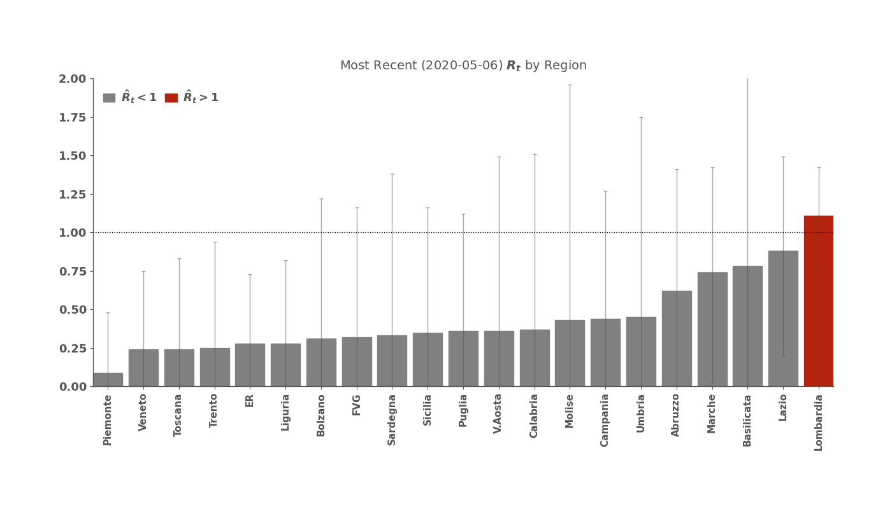
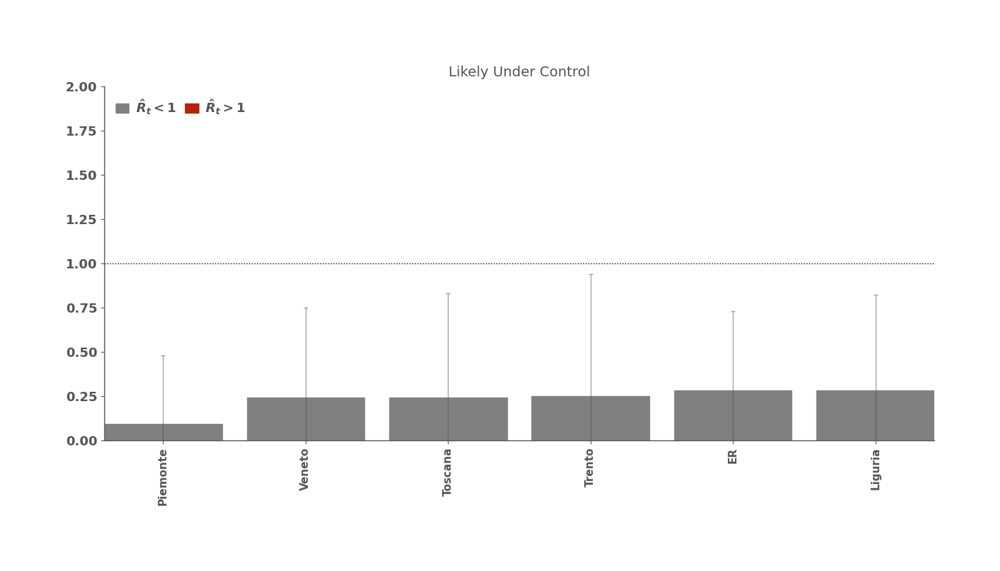

# COVID19 ANALYSIS

## Directory Structure
```.
COVID19/
├── plot
│   ├── Abruzzo
│   ├── Basilicata
│   ├── Calabria
│   ├── Campania
│   ├── Emilia-Romagna
│   ├── Friuli-Venezia Giulia
│   ├── Lazio
│   ├── Liguria
│   ├── Lombardia
│   ├── Marche
│   ├── Molise
│   ├── Piemonte
│   ├── Puglia
│   ├── Sardegna
│   ├── Sicilia
│   ├── Toscana
│   ├── Trentino-Alto Adige
│   ├── Umbria
│   ├── Valle d'Aosta
│   └── Veneto
├── realtimeR0_Italy
├── src
└── tables
    ├── Abruzzo
    ├── Basilicata
    ├── Calabria
    ├── Campania
    ├── Emilia-Romagna
    ├── Friuli-Venezia Giulia
    ├── Lazio
    ├── Liguria
    ├── Lombardia
    ├── Marche
    ├── Molise
    ├── Piemonte
    ├── Puglia
    ├── Sardegna
    ├── Sicilia
    ├── Toscana
    ├── Trentino-Alto Adige
    ├── Umbria
    ├── Valle d'Aosta
    └── Veneto
```
### src 
The [src directory](./src) contains the necessary files to compute the ISTAT data analysis. The python script that compute the mentioned analysis can be executed in the following ways:

First Option:

	1) Clone or download the repository (e.g. ```git clone```);
	2) Run the script ```./src/src_deceases_istat.py``` with python3;
    3) Follow the instructions that the script provides you.

Second Option (linux):

	1) Clone or download the repository (e.g. ```git clone```);
	2) Run the "run_istat.sh" bash script in the COVID19 folder;
    3) Follow the instructions that the script provides you.

### tables
The [tables directory](./tables) contains the csv files obtained from the ISTAT data analysis, divided by regions and provinces. For example, what follows is the csv table for all municipalities in sample for Marche (region of central Italy):

| **Comune**                 | **2019** | **2020** | **Variazione %** |
|----------------------------|----------|----------|------------------|
| Acqualagna                 | 14       | 12       | \-14\.29         |
| Acquasanta Terme           | 13       | 13       | 0\.0             |
| Acquaviva Picena           | 9        | 7        | \-22\.22         |
| Agugliano                  | 13       | 6        | \-53\.85         |
| Ancona                     | 326      | 346      | 6\.13            |
| Apecchio                   | 9        | 5        | \-44\.44         |
| Apiro                      | 8        | 9        | 12\.5            |
| Appignano                  | 19       | 14       | \-26\.32         |
| Appignano del Tronto       | 6        | 6        | 0\.0             |
| Arcevia                    | 26       | 24       | \-7\.69          |
| Arquata del Tronto         | 5        | 9        | 80\.0            |
| Barbara                    | 7        | 6        | \-14\.29         |
| Belforte all'Isauro        | 1        | 2        | 100\.0           |
| Belforte del Chienti       | 5        | 7        | 40\.0            |
| Belmonte Piceno            | 3        | 2        | \-33\.33         |
| Belvedere Ostrense         | 18       | 6        | \-66\.67         |
| Bolognola                  | 1        | 0        | \-100\.0         |
| Cagli                      | 38       | 37       | \-2\.63          |
| Camerano                   | 14       | 19       | 35\.71           |
| Camerata Picena            | 2        | 3        | 50\.0            |
| Camerino                   | 20       | 23       | 15\.0            |
| Campofilone                | 7        | 9        | 28\.57           |
| Camporotondo di Fiastrone  | 0        | 1        |                  |
| Cantiano                   | 12       | 20       | 66\.67           |
| Carassai                   | 4        | 4        | 0\.0             |
| Cartoceto                  | 13       | 23       | 76\.92           |
| Castelbellino              | 7        | 13       | 85\.71           |
| Castelfidardo              | 52       | 58       | 11\.54           |
| Castelleone di Suasa       | 7        | 7        | 0\.0             |
| Castelplanio               | 18       | 11       | \-38\.89         |
| Castelraimondo             | 13       | 16       | 23\.08           |
| Castelsantangelo sul Nera  | 0        | 0        |                  |
| Castignano                 | 16       | 12       | \-25\.0          |
| Castorano                  | 11       | 11       | 0\.0             |
| Chiaravalle                | 53       | 61       | 15\.09           |
| Cingoli                    | 38       | 47       | 23\.68           |
| Civitanova Marche          | 94       | 116      | 23\.4            |
| Colli al Metauro           | 33       | 29       | \-12\.12         |
| Colli del Tronto           | 6        | 6        | 0\.0             |
| Comunanza                  | 9        | 10       | 11\.11           |
| Corridonia                 | 47       | 46       | \-2\.13          |
| Cossignano                 | 4        | 5        | 25\.0            |
| Cupra Marittima            | 17       | 18       | 5\.88            |
| Cupramontana               | 14       | 24       | 71\.43           |
| Esanatoglia                | 10       | 8        | \-20\.0          |
| Fabriano                   | 106      | 112      | 5\.66            |
| Falconara Marittima        | 70       | 92       | 31\.43           |
| Falerone                   | 11       | 14       | 27\.27           |
| Fano                       | 168      | 234      | 39\.29           |
| Fermignano                 | 19       | 29       | 52\.63           |
| Fermo                      | 148      | 159      | 7\.43            |
| Fiastra                    | 0        | 1        | inf              |
| Filottrano                 | 20       | 41       | 105\.0           |
| Fiuminata                  | 3        | 5        | 66\.67           |
| Folignano                  | 16       | 19       | 18\.75           |
| Force                      | 9        | 8        | \-11\.11         |
| Fossombrone                | 32       | 43       | 34\.38           |
| Francavilla d'Ete          | 4        | 4        | 0\.0             |
| Fratte Rosa                | 3        | 6        | 100\.0           |
| Frontino                   | 1        | 0        | \-100\.0         |
| Gabicce Mare               | 15       | 22       | 46\.67           |
| Gagliole                   | 0        | 4        | inf              |
| Gradara                    | 7        | 18       | 157\.14          |
| Grottammare                | 39       | 44       | 12\.82           |
| Gualdo                     | 5        | 5        | 0\.0             |
| Isola del Piano            | 0        | 2        |                  |
| Jesi                       | 145      | 150      | 3\.45            |
| Lapedona                   | 5        | 4        | \-20\.0          |
| Loreto                     | 37       | 42       | 13\.51           |
| Loro Piceno                | 8        | 12       | 50\.0            |
| Lunano                     | 4        | 4        | 0\.0             |
| Macerata                   | 159      | 162      | 1\.89            |
| Magliano di Tenna          | 3        | 6        | 100\.0           |
| Maltignano                 | 6        | 5        | \-16\.67         |
| Massa Fermana              | 4        | 4        | 0\.0             |
| Massignano                 | 4        | 3        | \-25\.0          |
| Matelica                   | 29       | 29       | 0\.0             |
| Mercatello sul Metauro     | 8        | 4        | \-50\.0          |
| Mercatino Conca            | 3        | 4        | 33\.33           |
| Mergo                      | 3        | 10       | 233\.33          |
| Mogliano                   | 22       | 14       | \-36\.36         |
| Mombaroccio                | 5        | 13       | 160\.0           |
| Mondavio                   | 18       | 14       | \-22\.22         |
| Mondolfo                   | 38       | 57       | 50\.0            |
| Monsampietro Morico        | 2        | 4        | 100\.0           |
| Monsampolo del Tronto      | 16       | 16       | 0\.0             |
| Montappone                 | 6        | 4        | \-33\.33         |
| Monte Cavallo              | 1        | 2        | 100\.0           |
| Monte Cerignone            | 2        | 8        | 300\.0           |
| Monte Giberto              | 5        | 3        | \-40\.0          |
| Monte Grimano Terme        | 8        | 6        | \-25\.0          |
| Monte Rinaldo              | 0        | 2        |                  |
| Monte San Giusto           | 23       | 27       | 17\.39           |
| Monte San Martino          | 2        | 5        | 150\.0           |
| Monte San Pietrangeli      | 6        | 9        | 50\.0            |
| Monte San Vito             | 18       | 17       | \-5\.56          |
| Monte Urano                | 30       | 20       | \-33\.33         |
| Monte Vidon Combatte       | 1        | 3        | 200\.0           |
| Monte Vidon Corrado        | 1        | 2        | 100\.0           |
| Montecalvo in Foglia       | 9        | 9        | 0\.0             |
| Montecarotto               | 9        | 8        | \-11\.11         |
| Montecassiano              | 19       | 24       | 26\.32           |
| Monteciccardo              | 2        | 6        | 200\.0           |
| Montecopiolo               | 5        | 6        | 20\.0            |
| Montecosaro                | 13       | 14       | 7\.69            |
| Montedinove                | 0        | 0        |                  |
| Montefalcone Appennino     | 1        | 4        | 300\.0           |
| Montefano                  | 12       | 9        | \-25\.0          |
| Montefelcino               | 15       | 10       | \-33\.33         |
| Montefiore dell'Aso        | 8        | 8        | 0\.0             |
| Montefortino               | 6        | 2        | \-66\.67         |
| Montegallo                 | 3        | 1        | \-66\.67         |
| Montegiorgio               | 22       | 29       | 31\.82           |
| Montegranaro               | 29       | 39       | 34\.48           |
| Montelabbate               | 9        | 22       | 144\.44          |
| Monteleone di Fermo        | 0        | 1        |                  |
| Montelparo                 | 4        | 7        | 75\.0            |
| Montelupone                | 13       | 11       | \-15\.38         |
| Montemarciano              | 24       | 30       | 25\.0            |
| Monteprandone              | 32       | 32       | 0\.0             |
| Montottone                 | 7        | 5        | \-28\.57         |
| Moresco                    | 3        | 1        | \-66\.67         |
| Morro d'Alba               | 7        | 5        | \-28\.57         |
| Morrovalle                 | 30       | 25       | \-16\.67         |
| Muccia                     | 1        | 5        | 400\.0           |
| Numana                     | 9        | 11       | 22\.22           |
| Offagna                    | 4        | 3        | \-25\.0          |
| Offida                     | 23       | 18       | \-21\.74         |
| Ortezzano                  | 2        | 3        | 50\.0            |
| Palmiano                   | 0        | 0        |                  |
| Pedaso                     | 9        | 12       | 33\.33           |
| Peglio                     | 4        | 3        | \-25\.0          |
| Pergola                    | 31       | 33       | 6\.45            |
| Pesaro                     | 275      | 532      | 93\.45           |
| Petriano                   | 7        | 12       | 71\.43           |
| Petriolo                   | 5        | 4        | \-20\.0          |
| Petritoli                  | 12       | 10       | \-16\.67         |
| Piandimeleto               | 6        | 9        | 50\.0            |
| Pietrarubbia               | 5        | 1        | \-80\.0          |
| Pieve Torina               | 5        | 7        | 40\.0            |
| Piobbico                   | 7        | 10       | 42\.86           |
| Pioraco                    | 7        | 8        | 14\.29           |
| Poggio San Marcello        | 1        | 0        | \-100\.0         |
| Poggio San Vicino          | 1        | 2        | 100\.0           |
| Pollenza                   | 20       | 17       | \-15\.0          |
| Polverigi                  | 5        | 8        | 60\.0            |
| Ponzano di Fermo           | 8        | 4        | \-50\.0          |
| Porto Recanati             | 29       | 34       | 17\.24           |
| Porto San Giorgio          | 45       | 57       | 26\.67           |
| Porto Sant'Elpidio         | 67       | 80       | 19\.4            |
| Rapagnano                  | 11       | 4        | \-63\.64         |
| Recanati                   | 62       | 77       | 24\.19           |
| Ripatransone               | 13       | 16       | 23\.08           |
| Ripe San Ginesio           | 4        | 4        | 0\.0             |
| Roccafluvione              | 7        | 6        | \-14\.29         |
| Rotella                    | 10       | 2        | \-80\.0          |
| San Lorenzo in Campo       | 18       | 16       | \-11\.11         |
| San Marcello               | 5        | 5        | 0\.0             |
| San Paolo di Jesi          | 4        | 2        | \-50\.0          |
| San Severino Marche        | 42       | 57       | 35\.71           |
| Sant'Angelo in Vado        | 14       | 17       | 21\.43           |
| Sant'Elpidio a Mare        | 60       | 46       | \-23\.33         |
| Sant'Ippolito              | 4        | 6        | 50\.0            |
| Santa Maria Nuova          | 8        | 12       | 50\.0            |
| Santa Vittoria in Matenano | 5        | 10       | 100\.0           |
| Sarnano                    | 13       | 11       | \-15\.38         |
| Sassocorvaro Auditore      | 14       | 28       | 100\.0           |
| Sassofeltrio               | 5        | 6        | 20\.0            |
| Sassoferrato               | 28       | 23       | \-17\.86         |
| Sefro                      | 2        | 0        | \-100\.0         |
| Senigallia                 | 159      | 166      | 4\.4             |
| Serra San Quirico          | 13       | 11       | \-15\.38         |
| Serra Sant'Abbondio        | 4        | 3        | \-25\.0          |
| Serra de' Conti            | 10       | 17       | 70\.0            |
| Serrapetrona               | 1        | 2        | 100\.0           |
| Serravalle di Chienti      | 4        | 4        | 0\.0             |
| Servigliano                | 15       | 8        | \-46\.67         |
| Smerillo                   | 2        | 1        | \-50\.0          |
| Staffolo                   | 6        | 12       | 100\.0           |
| Tavoleto                   | 2        | 2        | 0\.0             |
| Tavullia                   | 17       | 18       | 5\.88            |
| Tolentino                  | 69       | 62       | \-10\.14         |
| Torre San Patrizio         | 11       | 6        | \-45\.45         |
| Trecastelli                | 23       | 19       | \-17\.39         |
| Urbania                    | 21       | 25       | 19\.05           |
| Urbino                     | 71       | 54       | \-23\.94         |
| Urbisaglia                 | 7        | 16       | 128\.57          |
| Ussita                     | 3        | 0        | \-100\.0         |
| Valfornace                 | 4        | 6        | 50\.0            |
| Vallefoglia                | 25       | 54       | 116\.0           |
| Venarotta                  | 9        | 7        | \-22\.22         |
| Visso                      | 4        | 3        | \-25\.0          |


### plot
The [plot directory](./plot) contains the plots obtained from the ISTAT data analysis, divided by regions and provinces. For example, what follows is the plot for all Italy municipalities in sample:


### RealtimeR0_Italy
The [RealtimeR0_Italy directory](./RealtimeR0_Italy) contains my adaptation of the [Kevyn Systrom code](https://github.com/k-sys/covid-19/blob/master/Realtime%20R0.ipynb) for Italy data on COVID19 confirmed cases. The code estimates Rt with a time-varying Bayesian approach, for details visit the [Kevin Systrom code](https://github.com/k-sys/covid-19/blob/master/Realtime%20R0.ipynb). Some of the results plot are:






