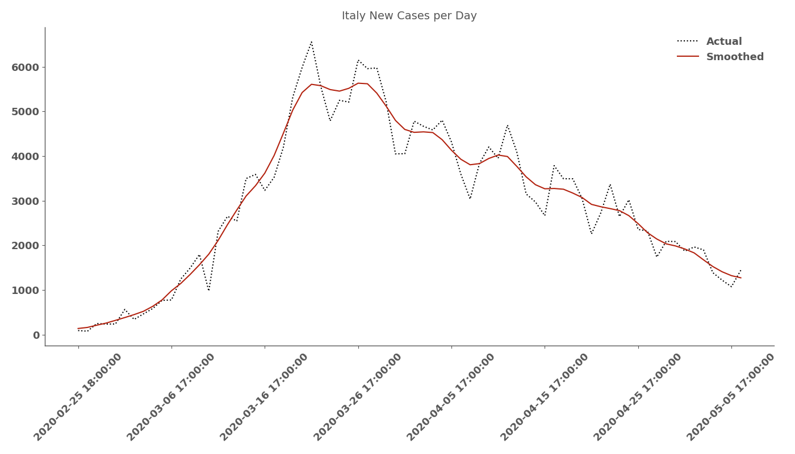

# COVID19 ANALYSIS

## Directory Structure
```.
COVID19/
├── plot
│   ├── Abruzzo
│   ├── Basilicata
│   ├── Calabria
│   ├── Campania
│   ├── Emilia-Romagna
│   ├── Friuli-Venezia Giulia
│   ├── Lazio
│   ├── Liguria
│   ├── Lombardia
│   ├── Marche
│   ├── Molise
│   ├── Piemonte
│   ├── Puglia
│   ├── Sardegna
│   ├── Sicilia
│   ├── Toscana
│   ├── Trentino-Alto Adige
│   ├── Umbria
│   ├── Valle d'Aosta
│   └── Veneto
├── realtimeR0_Italy
├── src
└── tables
    ├── Abruzzo
    ├── Basilicata
    ├── Calabria
    ├── Campania
    ├── Emilia-Romagna
    ├── Friuli-Venezia Giulia
    ├── Lazio
    ├── Liguria
    ├── Lombardia
    ├── Marche
    ├── Molise
    ├── Piemonte
    ├── Puglia
    ├── Sardegna
    ├── Sicilia
    ├── Toscana
    ├── Trentino-Alto Adige
    ├── Umbria
    ├── Valle d'Aosta
    └── Veneto
```

### plot
The [plot directory](./plot) contains the results on ISTAT data analysis. For example, what follows is the plot for all Italy municipalities in sample:


### RealtimeR0_Italy
The [RealtimeR0_Italy directory](./RealtimeR0_Italy) contains my adaptation of the [Kevyn Systrom code](https://github.com/k-sys/covid-19/blob/master/Realtime%20R0.ipynb) for Italy data on COVID19 confirmed cases. The code estimates Rt with a time-varying Bayesian approach, for details visit the [Kevin Systrom code](https://github.com/k-sys/covid-19/blob/master/Realtime%20R0.ipynb). Two of the results plot are:




